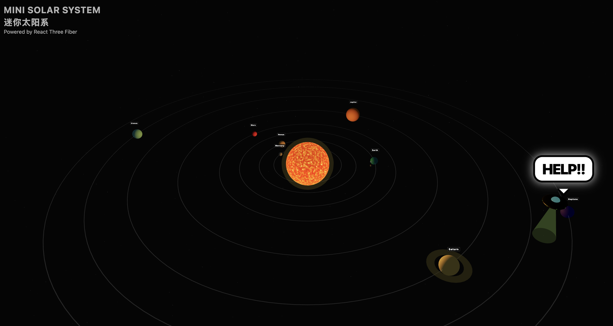
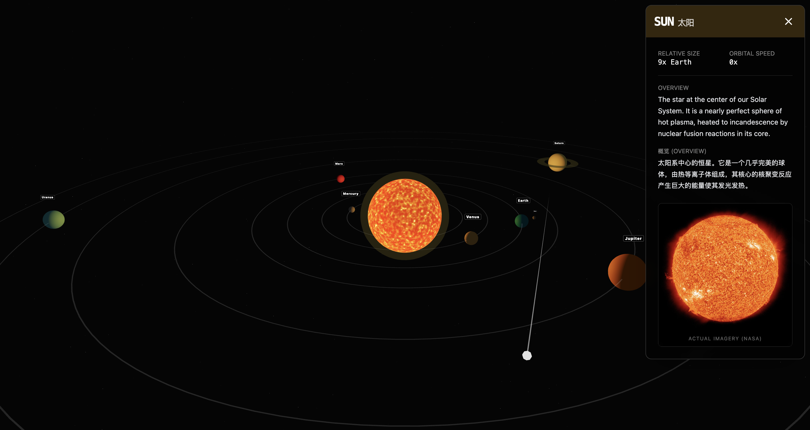

# ☀️ Mini Solar System

An interactive 3D solar system visualization built with **React Three Fiber**, featuring bilingual (English/Chinese) content and some fun easter eggs. Feel free the zoom in and out!

## Tech Stack

- React + TypeScript
- Three.js via @react-three/fiber
- @react-three/drei for helpers
- Tailwind CSS for styling
- Custom GLSL shaders for the Sun

## Credits

- NASA for planetary imagery
- React Three Fiber community for excellent 3D tools
- Gemini 2.5 (Google AI Studio)
- Woody Lin for... well, you'll see
